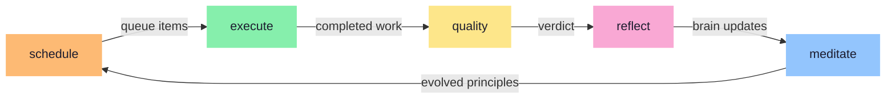

# noodle

The self-improving agent framework powered by skills

<div class="abs-bl m-6 flex gap-2 items-center text-sm op-60">
  <carbon-code /> Open source &nbsp;·&nbsp; Built with Go
</div>

<style>
h1 {
  font-family: 'Fraunces', serif;
  font-size: 4.5em !important;
  font-weight: 300 !important;
  letter-spacing: -0.03em;
  background: linear-gradient(135deg, #fde68a 0%, #fdba74 100%);
  -webkit-background-clip: text;
  -webkit-text-fill-color: transparent;
}
p {
  font-size: 1.3em !important;
  color: #a8a8b8 !important;
  letter-spacing: 0.01em;
}
</style>

---
layout: quote
---

# "Agents read files. Agents write files. It's the one thing every agent is already good at."

<style>
h1 {
  font-family: 'Fraunces', serif !important;
  font-size: 1.8em !important;
  font-weight: 300 !important;
  line-height: 1.5 !important;
  color: #fde68a !important;
}
</style>

---
layout: center
---

# Everything Is A File

All of noodle's state lives in your project's `.noodle/` directory

If it's not on disk, it doesn't exist

<v-clicks>

- No SDK to install
- No protocol to speak
- No integration layer to maintain
- Your agent already knows the API

</v-clicks>

<style>
h1 {
  font-family: 'Fraunces', serif !important;
  font-weight: 400 !important;
  color: #fde68a !important;
}
li {
  color: #a8a8b8 !important;
}
</style>

---

# A Skill Is Just a Markdown File

It tells an agent how to do something

```md
---
name: deploy
description: Deploy after successful execution on main
noodle:
  blocking: false
  schedule: "After a successful execute completes on main branch"
---

Check that all tests pass on main. Build the binary.
Deploy to production. Notify the team.
```

<v-click>

The `noodle:` block registers it as a schedulable task.
The skill resolver scans your skills, parses frontmatter, and builds the registry.

</v-click>

<style>
h1 {
  font-family: 'Fraunces', serif !important;
  font-weight: 400 !important;
  color: #fde68a !important;
}
</style>

---

# The Hello World

Two skills. A complete autonomous system.

<div class="grid grid-cols-2 gap-6 mt-4">

<div v-click>

```yaml
---
name: schedule
description: Read the backlog and decide
  what to work on next
noodle:
  blocking: true
  schedule: "Start of every cycle"
---

Read .noodle/mise.json.
Write .noodle/queue-next.json with items
you want to schedule next.
```

<div class="text-center mt-2 op-60 text-sm">schedule — the brain</div>

</div>

<div v-click>

```yaml
---
name: execute
description: Pick up a queued item
  and do the work
noodle:
  schedule: "When there are items
    in the queue"
---

Read the plan. Do the work.
Commit to the worktree.
```

<div class="text-center mt-2 op-60 text-sm">execute — the hands</div>

</div>

</div>

<style>
h1 {
  font-family: 'Fraunces', serif !important;
  font-weight: 400 !important;
  color: #fde68a !important;
}
</style>

---
layout: center
---

# The Autonomous Cycle

Each skill you add makes the system more capable



<style>
h1 {
  font-family: 'Fraunces', serif !important;
  font-weight: 400 !important;
  color: #fde68a !important;
}
</style>

---

# A Real Noodle App

These are actual skills from noodle's own `.agents/skills/` directory

<v-clicks>

| Skill | Schedule | Blocking |
|-------|----------|----------|
| **schedule** | When the queue is empty, after backlog changes, or when session history suggests re-evaluation | yes |
| **execute** | When backlog items with linked plans are ready for implementation | no |
| **quality** | After each cook session completes | no |
| **reflect** | After a cook session completes | no |
| **meditate** | Periodically after several reflect cycles have accumulated | no |
| **oops** | When infrastructure failures are detected | no |
| **debate** | When design decisions need structured evaluation | no |

</v-clicks>

<style>
h1 {
  font-family: 'Fraunces', serif !important;
  font-weight: 400 !important;
  color: #fde68a !important;
}
table {
  font-size: 0.8em !important;
}
th {
  color: #fde68a !important;
}
td:first-child {
  white-space: nowrap;
}
</style>

---
layout: two-cols
---

# How They Chain

Skills communicate through files

<v-clicks>

- **schedule** reads `mise.json`, writes `queue-next.json`
- **execute** picks an item, works in a worktree, commits
- **quality** reviews the diff, writes a verdict
- **reflect** captures learnings to `brain/`
- **meditate** extracts principles from accumulated notes

</v-clicks>

<div v-click class="mt-6 p-4 rounded-lg" style="background: #24243a;">

No task composition API —<br/>
agents pass state by writing files,<br/>
noodle picks up changes next cycle.

</div>

::right::

<div class="pl-6 mt-12">

```
.noodle/
├── mise.json          # backlog + state
├── queue-next.json    # next work items
└── quality/
    └── session-42.json

brain/
├── principles/
│   └── fix-root-causes.md
├── codebase/
│   └── worktree-gotchas.md
└── todos.md
```

</div>

<style>
h1 {
  font-family: 'Fraunces', serif !important;
  font-weight: 400 !important;
  color: #fde68a !important;
}
</style>

---
layout: center
---

# The Brain

An Obsidian vault that agents read before they start and write to after they finish

<div class="grid grid-cols-3 gap-8 mt-8">

<div v-click class="text-center">
  <div class="text-4xl mb-3">📖</div>
  <div class="text-lg font-bold" style="color: #93c5fd;">Read</div>
  <div class="text-sm op-60 mt-1">Principles, patterns,<br/>past mistakes</div>
</div>

<div v-click class="text-center">
  <div class="text-4xl mb-3">🔨</div>
  <div class="text-lg font-bold" style="color: #86efac;">Work</div>
  <div class="text-sm op-60 mt-1">Agent does the task,<br/>informed by context</div>
</div>

<div v-click class="text-center">
  <div class="text-4xl mb-3">✍️</div>
  <div class="text-lg font-bold" style="color: #f9a8d4;">Write</div>
  <div class="text-sm op-60 mt-1">Captures what it learned<br/>for the next agent</div>
</div>

</div>

<style>
h1 {
  font-family: 'Fraunces', serif !important;
  font-weight: 400 !important;
  color: #fde68a !important;
}
p {
  color: #a8a8b8 !important;
}
</style>

---

# Self-Improvement Is Built In

Two skills that make the system get smarter over time

<div class="grid grid-cols-2 gap-8 mt-6">

<div v-click class="p-5 rounded-lg" style="background: #24243a; border: 1px solid #f9a8d4;">

### reflect

After each session, the agent writes what it learned to the brain.

The next agent reads it and avoids the same mistakes.

<div class="text-sm mt-3" style="color: #f9a8d4;">
"This test pattern keeps failing because of X"
</div>

</div>

<div v-click class="p-5 rounded-lg" style="background: #24243a; border: 1px solid #93c5fd;">

### meditate

Looks at all learnings and extracts higher-level principles.

Updates your skills so every future decision is grounded by them.

<div class="text-sm mt-3" style="color: #93c5fd;">
"Always exhaust the design space before committing to a solution"
</div>

</div>

</div>

<style>
h1 {
  font-family: 'Fraunces', serif !important;
  font-weight: 400 !important;
  color: #fde68a !important;
}
h3 {
  font-family: 'Fraunces', serif !important;
  color: #f5f5f5 !important;
}
</style>

---
layout: center
---

# Run Anywhere

Because all coordination happens through files,
noodle can orchestrate agents locally or in the cloud

<div class="grid grid-cols-2 gap-12 mt-8 text-sm">

<div v-click>

### Local

- Agents run in tmux sessions
- Cheap tasks stay on your machine
- Full visibility in the TUI

</div>

<div v-click>

### Remote

- Agents run in VMs or containers
- Route expensive tasks to powerful machines
- 20 agents in parallel while your laptop idles

</div>

</div>

<div v-click class="mt-8 text-center op-60">

Agents work on branches, push their changes, noodle merges them back.

</div>

<style>
h1 {
  font-family: 'Fraunces', serif !important;
  font-weight: 400 !important;
  color: #fde68a !important;
}
h3 {
  color: #86efac !important;
}
</style>

---
layout: center
---

<div class="text-center">

# Skills are to noodle what components are to React

<div class="mt-8 text-lg op-60">

Your workflow becomes a series of skills.
Your agent describes when each one should run.
The scheduling agent figures out the rest.

</div>

</div>

<style>
h1 {
  font-family: 'Fraunces', serif !important;
  font-weight: 300 !important;
  font-size: 2.2em !important;
  color: #fde68a !important;
  line-height: 1.3 !important;
}
</style>

---
layout: end
---

<div class="text-center">
  <div style="font-family: 'Fraunces', serif; font-size: 2em; font-weight: 300; background: linear-gradient(135deg, #fde68a 0%, #fdba74 100%); -webkit-background-clip: text; -webkit-text-fill-color: transparent;">noodle</div>
  <div class="mt-4 op-50">github.com/poteto/noodle</div>
</div>
